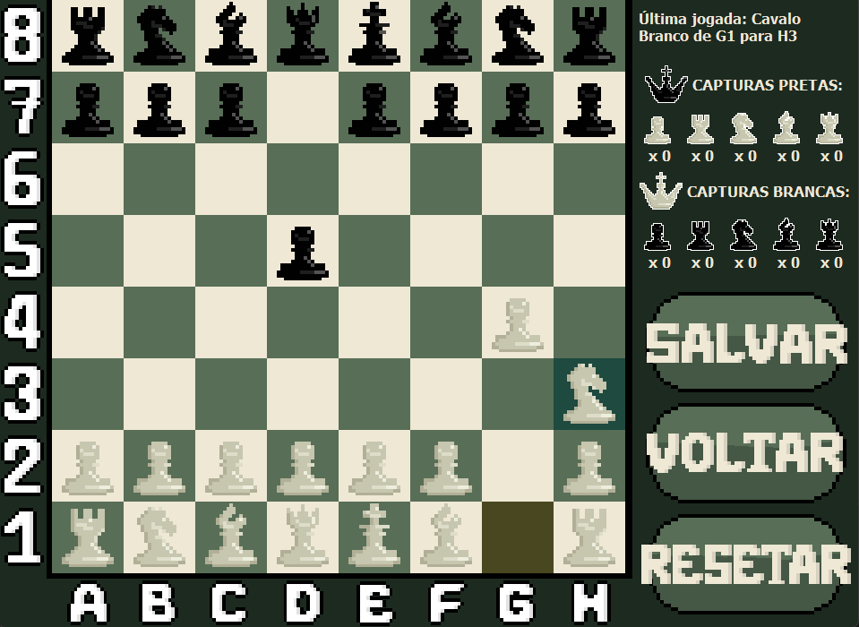

# ♟️ Jogo de Xadrez em Python

Um projeto completo de xadrez em Python com todas as regras oficiais, interface gráfica moderna e opção de jogar contra uma IA treinada com Q-Learning.

## 🚀 Funcionalidades

✅ Regras oficiais do xadrez: roque, en passant, promoção de peões
✅ Detecção automática de xeque e xeque-mate
✅ Interface gráfica moderna com PyQt5
✅ Histórico de jogadas e opção de desfazer movimentos
✅ Salvar e carregar partidas
✅ Modo PvE (jogador contra IA)

## 🛠️ Tecnologias e Bibliotecas

O projeto está desenvolvido em **Python 3.13** utilizando:

- [`PyQt5`](https://pypi.org/project/PyQt5/) – interface gráfica profissional moderna
- [`json`](https://docs.python.org/3/library/json.html) – salvar/abrir estados de jogo

Instale as dependências com:

pip install -r requirements.txt

## ▶️ Como executar

# Primeira forma

1. Baixe o release do projeto.
2. Instale as dependências.
2. Abra o terminal e navegue até a pasta "PyChessScripts".
3. Dentro da pasta, digite um dos comandos, para selecionar o modo de jogo:
- Jogar contra a IA: python jogador_vs_ia.py
- IA contra IA: python ia_vs_ia.py

# Segunda forma

1. Baixe o release do projeto.
2. Navegue dentro da pasta "Distrubuição", e rode os executáveis.